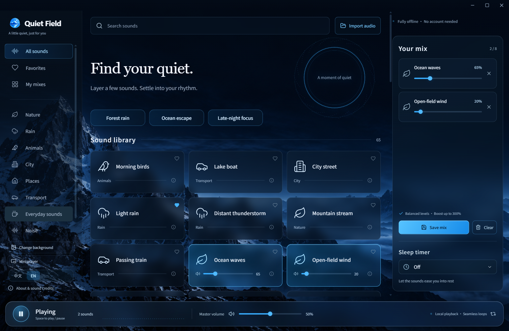
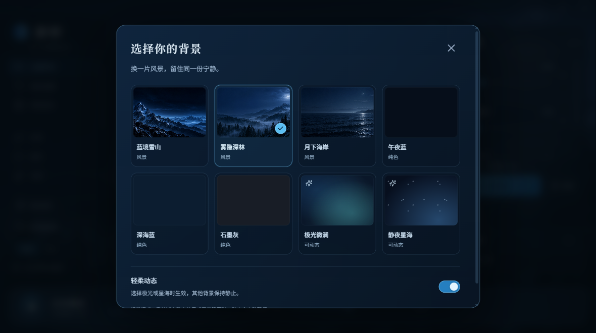
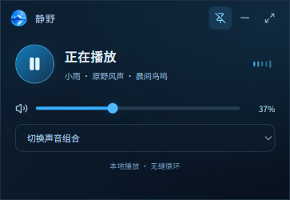

# Quiet Field · 静野

**Find your quiet.** A free, offline ambient sound mixer for Windows, with 65 built-in sounds and mixes you can make your own.

**English** · [简体中文](README.zh-CN.md)

> The current source targets 1.6.0 with the features below. The published download is still 1.5.0 (53 sounds); 1.6.0 has not been released yet.

[**Download for Windows**](https://github.com/Gary06868/QuietField/releases/download/v1.5.0/QuietField-1.5.0-Windows-x64-public.zip) · [Listen & explore](https://gary06868.github.io/QuietField/) · [Sound library](docs/audio-library.en.md) · [Feedback](https://github.com/Gary06868/QuietField/issues/new/choose)

[](https://github.com/Gary06868/QuietField/actions/workflows/build.yml)
[](LICENSE)
[](https://github.com/Gary06868/QuietField/releases/latest)



## A little quiet, on your terms

- **65 sounds, ready offline.** Rain, ocean waves, forests, cat purring, wind chimes, trains and more, plus white, pink and brown noise. All recordings come in the download.
- **Your own soundscape.** Layer up to 8 sounds, adjust each level, favorite your picks and save named mixes locally.
- **Natural transitions.** Edge-silence trimming, crossfading and continuous audio-buffer looping reduce abrupt restarts. Distinct events can still sound repetitive.
- **Balanced levels.** Automatic baseline loudness adjustment, individual controls up to 300%, and output peak protection.
- **Bring your own audio.** Import supported MP3, WAV, OGG and FLAC files: up to 40 MB, 5 minutes and 2 channels per file. Files stay on your computer.
- **Mini player and tray controls.** Play/pause, master volume, presets and saved mixes in a small optional always-on-top window. Keep listening from the tray.
- **8 backgrounds.** Alpine, forest, moonlit coast, three solid colors, aurora and starlight. Motion is optional and pauses when hidden.
- **A softer finish.** A sleep timer fades out during its final 15 seconds.
- **English & 简体中文.** Follows your system language on first launch; switch any time without interrupting playback. Search in either language.
- **No accounts, ads or telemetry.** No subscription. No cloud upload. Free and open source.

The library includes 44 original PCM WAV recordings from BigSoundBank, including 26 at 24-bit / 48 kHz. [Browse all 65 sounds and recording notes](docs/audio-library.en.md).





## Download & start listening

1. Download **[QuietField-1.5.0-Windows-x64-public.zip](https://github.com/Gary06868/QuietField/releases/download/v1.5.0/QuietField-1.5.0-Windows-x64-public.zip)** (about 832 MB).
2. Extract the **whole ZIP** into a folder.
3. Open `QuietField-win32-x64/静野.exe` (静野 is the app’s Chinese name).

No Node.js, Python, installation wizard or account is needed. Keep the executable with its accompanying files. Checksums are on the [release page](https://github.com/Gary06868/QuietField/releases/tag/v1.5.0). GitHub’s source archives contain code, **not the bundled audio**.

**Platform:** Windows x64. macOS, Linux and Windows ARM64 builds are not available yet. The app is unsigned, so Windows may show a reputation warning; use this repository’s official releases. Local desktop tests and Windows CI are not a substitute for testing on every PC.

**Upgrading:** extract the new version into a new folder. Public-edition preferences and imports live separately under `%APPDATA%/QuietField-Public`. Keep that data folder to retain them. Language switching preserves existing sound IDs and user-written mix names.

## Questions

**Why is the download large?** The current source bundles 62 recordings (50 in published version 1.5.0) so the app works offline. Many are original, uncompressed WAV files. The other 3 sounds are generated noise.

**Can I use it offline?** Yes. The desktop app blocks external HTTP/HTTPS requests. Fonts, artwork and audio are bundled. Optional website previews need a connection and use GitHub Pages hosting; there is no added analytics script.

**Where are my mixes?** Favorites and mixes are in local preferences; imports are in a local database. To move to another PC, close the app and back up the entire data folder. There is no standalone mix export or cloud sync yet.

**What about displays and performance?** The window adapts to the system’s scaled work area; the layout responds to its width. “About & sound credits” includes a reduced-effects mode. Cached and playing PCM has an admission budget, not a cap on total process memory. Real mixed-DPI hot-plugging, Bluetooth switching and overnight playback still need wider field testing.

**Does a download count mean a user?** No. GitHub counts release-asset downloads, including repeats. We do not track active users in the app.

## Build from source

Requires Node.js 22 and npm. Installing dependencies and the first audio download require a connection.

```sh
npm ci
npm run fetch:audio
npm test
npm run build
npm start
npm run package
```

Packages go to `releases/1.6.0-public/`. Downloads and builds verify the per-file SHA-256 manifest; changed upstream files stop the build for review. BigSoundBank downloads follow its official form and anonymous waiting period.

Desktop checks require a desktop session and use isolated test data:

```sh
npm run verify:desktop
npm run verify:window
npm run verify:companion
node scripts/verify-i18n.mjs
node scripts/verify-release.mjs
node scripts/verify-devices.mjs
node scripts/audit-audio.mjs
```

## Help shape the next version

[Report a bug or suggest a sound](https://github.com/Gary06868/QuietField/issues/new/choose), improve a translation, or share a recording with a clear redistribution license. English and Chinese feedback are welcome. See [CONTRIBUTING](CONTRIBUTING.md). If it helps you, sharing it with someone who might use it is welcome.

## License & credits

Code: [MIT](LICENSE). **Audio has its own per-recording license**, not the code license. Authors, sources, upstream edits, licenses and hashes are in [THIRD_PARTY_NOTICES](THIRD_PARTY_NOTICES.md) and `src/catalog.public.json`. The public library uses documented CC0, Public Domain and CC BY recordings.

Thanks to the recordists, BigSoundBank, Freesound, SoundBible and Blanket’s audio collection. Icons are from Lucide; bundled Chinese fonts are Noto Sans SC and Noto Serif SC. The app icon and mountain background were made with an image-generation tool. Full licenses ship with the app.
