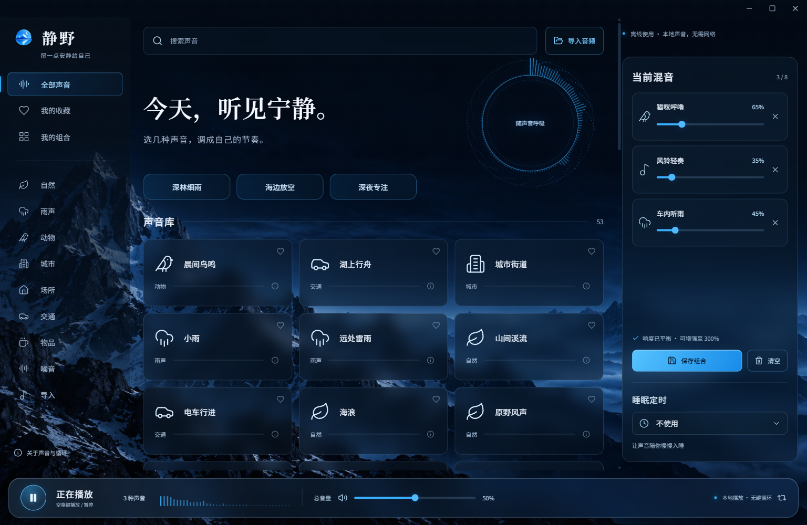

# 静野 · Quiet Field

免费的离线白噪声与环境音混音工具。给专注、休息和入睡留一点安静。

[**下载 Windows 版**](https://github.com/Gary06868/QuietField/releases/download/v1.4.0/QuietField-1.4.0-Windows-x64-public.zip) · [全部版本](https://github.com/Gary06868/QuietField/releases) · [音源清单](docs/audio-library.md)

[](https://github.com/Gary06868/QuietField/actions/workflows/build.yml)



- **免费使用，无需账户**：录音在本机播放，导入文件不会上传。
- **53 种内置声音**：50 段自然、雨声、动物、城市、交通及室内环境录音，另有白噪声、粉噪声和棕噪声。
- **自定义声音方案**：最多混合 8 种声音，分别调节音量、收藏并保存组合。
- **更自然的循环**：清理首尾静音、交叉淡化，并由音频引擎连续循环；环境事件仍可能听出重复。
- **响度平衡**：自动调整基础响度，每路可调至 300%，末端有峰值保护。
- **导入自己的录音**：支持浏览器可解码的 MP3、WAV、OGG、FLAC 等，单文件不超过 40 MB、5 分钟、双声道。
- **睡眠定时**：最后 15 秒逐渐淡出。
- **屏幕适配**：根据系统缩放后的工作区调整窗口，记住大小和位置，显示器拔出后将窗口移回可见区域。界面随窗口宽度重新排布。
- **轻量模式**：在“关于静野”中关闭动画与背景模糊。

本次新增 32 段原始 WAV，包括猫咪呼噜、风铃、机械时钟、帐篷雷雨、车内听雨和列车车厢；其中 17 段为 24-bit / 48 kHz。查看[音源清单与录音特点](docs/audio-library.md)。

## 下载与运行

从 [GitHub Releases](https://github.com/Gary06868/QuietField/releases/tag/v1.4.0) 下载 **QuietField-1.4.0-Windows-x64-public.zip**（约 832 MB），完整解压，再运行 `QuietField-win32-x64/静野.exe`。无需安装 Node.js 或 Python；不要单独移出可执行文件。当前版本 **1.4.0**。

程序包内已包含全部音源，使用时无需联网。开发者可下载源码包或克隆本仓库；GitHub 自动生成的 Source code 不含音频，需按下方步骤下载。发布页附 SHA256SUMS.txt，可校验下载完整性。

目前验证平台是本机 Windows x64。macOS、Linux、Windows ARM64 尚未提供经过实机验收的发行包，不能将源码可移植性等同于平台支持。应用暂未签名；首次下载可能出现系统信誉提示。

## 构建

需要 Node.js 22、npm 和网络。运行时可完全离线；首次安装依赖、下载音源需要网络。新增原始 WAV 合计约 671 MB，下载需要一定时间；BigSoundBank 下载器遵循官网表单和匿名倒计时。

```sh
npm ci
npm run fetch:audio
npm test
npm run build
npm start
npm run package
```

发行目录位于 `releases/1.4.0-public/`。声音由逐文件清单下载，下载与构建都会检查 SHA-256；上游内容变动时会停止，须人工复核后才能更新。字体、图形和所有录音会随应用打包，不依赖系统中文字体或在线音源。

```sh
npm run verify:desktop
npm run verify:window
node scripts/verify-release.mjs
node scripts/verify-devices.mjs
node scripts/audit-audio.mjs
```

界面自动化需要桌面会话；测试使用独立数据目录。GitHub Actions 会执行 Windows 自动构建；状态与日志见 [Actions](https://github.com/Gary06868/QuietField/actions)。

## 隐私与数据

没有账号、遥测或云端上传。收藏和组合保存在本地偏好中，导入音频副本保存在本机数据库中。Windows 数据目录通常是 `%APPDATA%/QuietField-Public`（早期个人版为 `%APPDATA%/QuietField`，两者分开保存，避免缺少旧音源时覆盖个人方案）。升级不会主动删除这个目录；跨电脑迁移请在完全退出应用后备份整个目录。组合暂不提供单独导出按钮。

解码顺序执行，已缓存和播放的 PCM 数据有准入预算（常规 384 MiB，浏览器识别为低内存设备时 192 MiB）。这不是进程总内存上限；解码及处理仍需额外临时内存。预算不足会提示减少混音中的长录音。

休眠、设备切换后的恢复逻辑已加入，但系统主动休眠或关闭设备无法保证声音连续；蓝牙切换、真实多显示器和整夜播放仍需进一步实机验证。

## 许可与致谢

代码采用 [MIT](LICENSE)。**录音不自动适用代码的 MIT 许可**，逐段作者、来源、许可、上游编辑和校验值见 [第三方署名](THIRD_PARTY_NOTICES.md) 及 `src/catalog.public.json`。公开版只包含已建立逐段记录的 CC0、Public Domain、CC BY 录音。

感谢录音作者、BigSoundBank、Freesound、SoundBible 与 Blanket 的音源整理。界面图标来自 Lucide，字体为 Noto Sans SC / Noto Serif SC，完整许可随包提供。应用图标与山景背景由图像生成工具制作。

早期个人版的 93 声音清单含有尚未逐段明确对应授权的音源，**不包含在这个公开版中**。不会用同一录音的改名、切片或重复条目增加声音数量。声音库会继续按逐段授权记录扩充，目前按实际数量描述。
