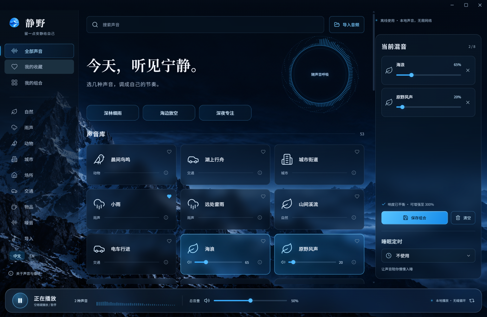

# 静野 · Quiet Field

**留一点安静给自己。** 免费、离线的 Windows 白噪声与环境音混音工具，内置 53 种声音，可以保存自己的声音方案。

[English](README.md) · **简体中文**

[**下载 Windows 版**](https://github.com/Gary06868/QuietField/releases/download/v1.5.0/QuietField-1.5.0-Windows-x64-public.zip) · [在线试听与介绍](https://gary06868.github.io/QuietField/zh-CN/) · [音源清单](docs/audio-library.md) · [反馈问题](https://github.com/Gary06868/QuietField/issues/new/choose)

[](https://github.com/Gary06868/QuietField/actions/workflows/build.yml)
[](LICENSE)
[](https://github.com/Gary06868/QuietField/releases/latest)



## 按自己的节奏，听见宁静

- **53 种内置声音**：雨、海浪、森林、猫咪呼噜、风铃、列车等 50 段录音，加上白噪声、粉噪声和棕噪声。下载后全部离线可用。
- **保存自己的声音方案**：最多混合 8 种声音，分别调节音量，收藏喜欢的声音，并为组合命名保存。
- **更自然地循环**：清理首尾静音、交叉淡化，由音频引擎连续循环，减少突兀接缝；明显环境事件仍可能听出重复。
- **响度平衡**：自动调整基础响度，每路可增强到 300%，末端有峰值保护。
- **导入自己的录音**：支持可解码的 MP3、WAV、OGG、FLAC 等，单文件不超过 40 MB、5 分钟、双声道。文件保存在本机。
- **睡眠定时**：最后 15 秒逐渐淡出。
- **中英文完整界面**：首次启动跟随系统语言，随时切换且不打断播放；两种语言的关键词都能搜索声音。
- **免费、无广告、无账号、无遥测**：没有订阅，也不上传你的录音。

内置 32 段 BigSoundBank 原始 PCM WAV，其中 17 段为 24-bit / 48 kHz。[查看音源清单与录音特点](docs/audio-library.md)。

## 下载与使用

1. 下载 **[QuietField-1.5.0-Windows-x64-public.zip](https://github.com/Gary06868/QuietField/releases/download/v1.5.0/QuietField-1.5.0-Windows-x64-public.zip)**（约 832 MB）。
2. **完整解压**整个 ZIP。
3. 运行 `QuietField-win32-x64/静野.exe`。

不需要 Node.js、Python 或账号。保留程序同目录的其他文件，不要单独移出 EXE。[发布页](https://github.com/Gary06868/QuietField/releases/tag/v1.5.0)有 SHA-256 校验文件。GitHub 自动生成的源码包**不含音频**，开发者需按下面步骤获取音源。

目前提供 **Windows x64** 版本；macOS、Linux、Windows ARM64 暂无发行包。程序未代码签名，首次下载可能出现系统信誉提示，请只从此仓库的正式发布页下载。本机测试和 Windows 云端构建不代表所有电脑均已实测。

**升级**：把新版本解压到新文件夹。公开版偏好和导入文件独立保存在 `%APPDATA%/QuietField-Public`，保留该目录即可继续使用。语言切换不改变声音 ID 或你自己写的方案名称。

## 常见问题

**安装包为什么大？** 50 段录音随包提供，很多是未重编码的原始 WAV，所以使用时无需联网。另外 3 种声音由算法生成。

**真的可以离线用吗？** 可以。桌面程序阻止外部 HTTP/HTTPS 请求，字体、图形和声音均已打包。可选的网页试听需联网，由 GitHub Pages 托管；页面未添加统计脚本。

**方案保存在哪里？** 收藏与组合在本地偏好中，导入音频在本机数据库。迁移电脑时，请完全退出后备份整个数据目录。目前没有单独的方案导出按钮或云同步。

**显示器和性能如何适配？** 窗口按系统缩放后的工作区调整，界面随宽度重新排布。“关于声音与循环”中可以开启轻量模式。PCM 缓存与播放有准入预算，但不是进程内存上限。真实混合 DPI 热插拔、蓝牙切换、整夜播放仍需更多电脑的反馈。

**下载量等于使用人数吗？** 不等于。GitHub 统计附件下载次数，重复下载也会累计；应用不采集活跃用户数据。

## 从源码构建

需要 Node.js 22、npm 和网络；首次安装依赖与下载声音后，运行时可完全离线。

```sh
npm ci
npm run fetch:audio
npm test
npm run build
npm start
npm run package
```

发行目录为 `releases/1.5.0-public/`。下载和构建均检查 SHA-256；上游变化时停止等待复核。BigSoundBank 下载器遵循官网表单和匿名倒计时。

桌面检查使用独立测试数据，需要桌面会话：

```sh
npm run verify:desktop
npm run verify:window
node scripts/verify-i18n.mjs
node scripts/verify-release.mjs
node scripts/verify-devices.mjs
node scripts/audit-audio.mjs
```

## 一起改进

欢迎[反馈问题或推荐声音](https://github.com/Gary06868/QuietField/issues/new/choose)、修改翻译、提供有明确再分发授权的录音，中英文均可。详见[贡献指南](CONTRIBUTING.md)。如果对你有帮助，也欢迎分享给可能需要的人。

## 许可与致谢

代码采用 [MIT](LICENSE)。**录音不自动适用代码的 MIT 许可**；逐段作者、来源、许可、上游编辑及校验值见[第三方署名](THIRD_PARTY_NOTICES.md)与 `src/catalog.public.json`。公开版仅含有逐段记录的 CC0、Public Domain 和 CC BY 录音。

感谢录音作者、BigSoundBank、Freesound、SoundBible 与 Blanket 的音源整理。界面图标来自 Lucide，中文字体为 Noto Sans SC / Noto Serif SC，完整许可随包提供。应用图标与山景背景由图像生成工具制作。
